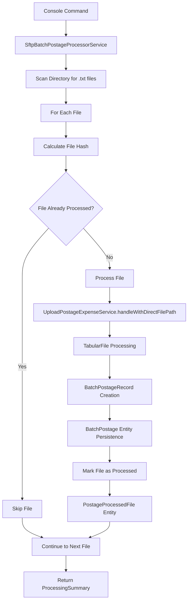

# SFTP Batch Processing Architecture

## Overview

This document outlines the technical architecture for enhancing the Hub Plus API's postage processing capabilities to handle batch processing of SFTP files with comprehensive audit trails and duplicate prevention.

## Current Architecture Analysis

### Existing Components

**UploadPostageExpenseService (`src/Service/UploadPostageExpenseService.php`)**
- Handles individual file uploads via `handleFromUpload()` method
- Core processing logic in `handleWithDirectFilePath()` method
- Uses `TabularFile` for Excel/CSV parsing
- Processes records through `BatchPostageRecord` value objects

**BatchPostageRecordMap (`src/ValueObject/BatchPostageRecordMap.php`)**
- Maps file columns to entity properties using flexible string matching
- Current mappings:
  - `reference`: `'Job ID,jobid,job_id'`
  - `quantity_sent`: `'Pieces,pieces'`
  - `cost`: `'Amount,amount'`

**BatchPostage Entity (`src/Entity/BatchPostage.php`)**
- Stores processed postage records
- Key fields: `reference` (Job ID), `quantitySent`, `cost`
- Uses `TimestampableDateTimeTZTrait` for created/updated tracking

### Current Limitations

1. **Column Mapping Gap**: SFTP files use "Number of Pieces" and "Transaction Amount" headers not covered by current mappings
2. **No Batch Processing**: Can only process one file at a time
3. **Limited Duplicate Prevention**: Only prevents duplicate Job IDs, not file-level duplicates
4. **No Processing Audit**: No tracking of which files have been processed

## Enhanced Architecture

### New Components

#### 1. SftpBatchPostageProcessorService

**Purpose**: Orchestrate batch processing of SFTP directory with audit trail

**Location**: `src/Service/SftpBatchPostageProcessorService.php`

```php
<?php
namespace App\Service;

use App\Entity\PostageProcessedFile;use App\Module\Stochastic\Feature\PostageUploads\Service\UploadPostageExpenseService;use App\Module\Stochastic\Feature\PostageUploadsSftp\Repository\PostageProcessedFileRepository;use Psr\Log\LoggerInterface;

readonly class SftpBatchPostageProcessorService
{
    public function __construct(
        private UploadPostageExpenseService $uploadService,
        private PostageProcessedFileRepository $processedFileRepository,
        private LoggerInterface $logger
    ) {}

    /**
     * Process all .txt files in directory
     * @return ProcessingSummary Summary of processing results
     */
    public function processDirectory(string $directoryPath): ProcessingSummary;

    /**
     * Process single file with duplicate checking
     * @param bool $skipIfProcessed Skip file if already processed
     */
    public function processFile(string $filePath, bool $skipIfProcessed = true): bool;

    /**
     * Check if file already processed (filename + content hash)
     */
    private function isFileAlreadyProcessed(string $filename, string $fileHash): bool;

    /**
     * Mark file as processed with metadata
     */
    private function markFileAsProcessed(
        string $filename,
        string $fileHash,
        array $metadata
    ): PostageProcessedFile;

    /**
     * Calculate file content hash using existing FileHash Value Object
     */
    private function calculateFileHash(string $filePath): string;
}
```

#### 2. PostageProcessedFile Entity

**Purpose**: Audit trail for processed SFTP files

**Location**: `src/Entity/PostageProcessedFile.php`

```php
<?php
namespace App\Entity;

use App\Module\Stochastic\Feature\PostageUploadsSftp\Repository\PostageProcessedFileRepository;use Doctrine\DBAL\Types\Types;use Doctrine\ORM\Mapping as ORM;

#[ORM\Entity(repositoryClass: PostageProcessedFileRepository::class)]
#[ORM\HasLifecycleCallbacks]
class PostageProcessedFile
{
    use Trait\TimestampableDateTimeTZTrait;
    use Trait\UuidTrait;

    #[ORM\Id]
    #[ORM\GeneratedValue(strategy: 'IDENTITY')]
    #[ORM\Column]
    private ?int $id = null;

    #[ORM\Column(type: Types::STRING, length: 255)]
    private string $filename;

    #[ORM\Column(type: Types::STRING, length: 32)]
    private string $fileHash; // MD5 hash via FileHash Value Object

    #[ORM\Column]
    private \DateTimeImmutable $processedAt;

    #[ORM\Column]
    private int $recordsProcessed = 0;

    #[ORM\Column(type: Types::STRING, length: 20)]
    private string $status = 'SUCCESS'; // SUCCESS, FAILED, PARTIAL

    #[ORM\Column(type: Types::TEXT, nullable: true)]
    private ?string $errorMessage = null;

    #[ORM\Column(type: Types::JSON, nullable: true)]
    private ?array $metadata = null; // Additional processing info

    // Getters and setters...
}
```

#### 3. Enhanced BatchPostageRecordMap

**Purpose**: Support SFTP-specific column headers while maintaining backward compatibility

**Location**: `src/ValueObject/BatchPostageRecordMap.php` (enhanced)

```php
<?php
namespace App\ValueObject;

class BatchPostageRecordMap extends AbstractRecordMap
{
    public ?string $reference = null;
    public ?string $quantity_sent = null;
    public ?string $cost = null;

    public function __construct()
    {
        // Enhanced mappings to support SFTP files
        $this->reference = 'Job ID,jobid,job_id';
        $this->quantity_sent = 'Number of Pieces,Pieces,pieces'; // Added SFTP column
        $this->cost = 'Transaction Amount,Amount,amount';         // Added SFTP column
    }
}
```

#### 4. ProcessingSummary Value Object

**Purpose**: Structured response for batch processing operations

**Location**: `src/ValueObject/ProcessingSummary.php`

```php
<?php
namespace App\ValueObject;

readonly class ProcessingSummary
{
    public function __construct(
        public int $totalFiles,
        public int $processedFiles,
        public int $skippedFiles,
        public int $failedFiles,
        public int $totalRecords,
        public array $errors = [],
        public float $processingTimeSeconds = 0.0
    ) {}

    public function isSuccessful(): bool
    {
        return $this->failedFiles === 0;
    }

    public function hasErrors(): bool
    {
        return !empty($this->errors) || $this->failedFiles > 0;
    }
}
```

#### 5. Console Command

**Purpose**: CLI interface for batch processing

**Location**: `src/Command/ProcessSftpPostageFilesCommand.php`

```php
<?php
namespace App\Command;

use App\Module\Stochastic\Feature\PostageUploadsSftp\Service\SftpBatchPostageProcessorService;use Symfony\Component\Console\Command\Command;

#[AsCommand(
    name: 'hub:postage:process-sftp-directory',
    description: 'Process USPS postage files from SFTP directory with audit trail',
)]
class ProcessSftpPostageFilesCommand extends Command
{
    public function __construct(
        private SftpBatchPostageProcessorService $processor
    ) {
        parent::__construct();
    }

    protected function configure(): void
    {
        $this
            ->setDescription('Process USPS postage files from SFTP directory')
            ->addArgument('directory', InputArgument::REQUIRED, 'Directory containing SFTP files')
            ->addOption('reprocess', 'r', InputOption::VALUE_NONE, 'Reprocess already processed files');
    }

    protected function execute(InputInterface $input, OutputInterface $output): int
    {
        // Command implementation...
    }
}
```

## Data Flow Architecture

### Processing Flow



### Database Schema

```sql
-- New audit table
CREATE TABLE postage_processed_file (
    id SERIAL PRIMARY KEY,
    uuid UUID NOT NULL UNIQUE,
    filename VARCHAR(255) NOT NULL,
    file_hash VARCHAR(32) NOT NULL, -- MD5 hash (32 characters)
    processed_at TIMESTAMPTZ NOT NULL,
    records_processed INTEGER NOT NULL DEFAULT 0,
    status VARCHAR(20) NOT NULL DEFAULT 'SUCCESS',
    error_message TEXT,
    metadata JSONB,
    created_at TIMESTAMPTZ NOT NULL,
    updated_at TIMESTAMPTZ NOT NULL,

    UNIQUE(filename, file_hash) -- Prevent duplicate processing
);

-- Enhanced batch_postage table (existing, no changes needed)
-- Optionally add file reference for audit trail:
-- ALTER TABLE batch_postage ADD COLUMN processed_from_file_id INTEGER REFERENCES postage_processed_file(id);
```

## Test-Driven Development Strategy

### Test File Utilization

The existing test files in `tests/Files/usps/sftp/` (38 files) provide perfect TDD foundation:

**File Pattern**: `YYYYMMDDHHMMSS_46003456_EPS_CM_HR_XXXX.txt`
**Data Structure**: CSV format with headers matching SFTP specifications
**Test Scenarios**: Various dates, record counts, and transaction amounts

### TDD Implementation Phases

#### Phase 1: Test Infrastructure
1. **Create Base Test Classes**
   - `SftpBatchProcessorServiceTest.php`
   - `PostageProcessedFileRepositoryTest.php`
   - Abstract test helpers for file management

2. **Write Failing Tests First**
   ```php
   public function testProcessDirectoryWithNoFiles(): void
   {
       // Test empty directory handling
   }

   public function testProcessSingleSftpFile(): void
   {
       // Test single file processing
   }

   public function testSkipAlreadyProcessedFile(): void
   {
       // Test duplicate prevention
   }
   ```

#### Phase 2: Core Service TDD
1. **Red**: Write failing tests for `SftpBatchPostageProcessorService`
2. **Green**: Implement minimum code to pass tests
3. **Refactor**: Optimize and improve code structure
4. **Repeat**: For each method and scenario

#### Phase 3: Integration TDD
1. **End-to-End Tests**: Process actual SFTP test files
2. **Database Integration**: Verify audit trail persistence
3. **Error Handling**: Test failure scenarios with malformed files
4. **Performance Tests**: Verify processing time requirements

### Test Coverage Requirements

- **Unit Tests**: 100% coverage for all new service methods
- **Integration Tests**: All major workflows tested end-to-end
- **Edge Cases**: Error conditions, empty files, malformed data
- **Performance Tests**: Benchmark with full test file set

## Security Considerations

### File Security
- Validate file paths to prevent directory traversal
- Restrict processing to specific file extensions (.txt)
- Implement file size limits to prevent resource exhaustion
- Use existing `FileHash` Value Object for consistent hash generation

### Data Security
- Sanitize file content before processing
- Use parameterized queries for database operations
- Log security-relevant events (file access, processing failures)
- MD5 hashing via `FileHash` provides adequate duplicate detection

### Access Control
- Console command should require appropriate permissions
- Audit trail provides accountability for processing actions
- File hash detects content changes (not cryptographic security)

## Performance Considerations

### Scalability
- **File Processing**: Stream processing to handle large files
- **Database Operations**: Batch inserts with transaction boundaries
- **Memory Management**: Process files sequentially to control memory usage

### Optimization Opportunities
- **Parallel Processing**: Future enhancement for concurrent file processing
- **Caching**: File hash caching for frequently accessed files
- **Indexing**: Database indexes on frequently queried fields

### Expected Performance
- **Baseline**: Process 38 test files (avg 15 records each) in <30 seconds
- **Memory**: <50MB RAM usage regardless of file count
- **Database**: <1000 queries for full test file set processing

## Migration & Deployment

### Database Migration
```php
// New migration file
public function up(Schema $schema): void
{
    $this->addSql('CREATE TABLE postage_processed_file (...)');
    $this->addSql('CREATE UNIQUE INDEX UNIQ_filename_hash ON postage_processed_file (filename, file_hash)');
    // Note: file_hash column is VARCHAR(32) for MD5 hashes
}
```

### Deployment Checklist
- [ ] Run database migrations
- [ ] Deploy new service classes
- [ ] Register console command
- [ ] Update documentation
- [ ] Test with production-like data
- [ ] Monitor initial processing runs

## Monitoring & Maintenance

### Logging Strategy
- File processing start/completion
- Error conditions with context
- Performance metrics (files/second, records/second)
- Audit trail access events

### Maintenance Tasks
- Regular cleanup of old audit records
- Monitor disk space for file processing
- Performance monitoring and optimization
- Security audit of file access patterns

## Future Enhancements

### Potential Improvements
- **Real-time Processing**: SFTP polling and automatic processing
- **Web Interface**: GUI for file management and monitoring
- **Advanced Reporting**: Processing analytics and trends
- **API Integration**: REST endpoints for programmatic access
- **Notification System**: Email/Slack alerts for processing events

### Integration Points
- **Monitoring Systems**: Prometheus/Grafana metrics
- **ETL Pipeline**: Integration with data warehouse
- **Business Intelligence**: Processing reports and dashboards
